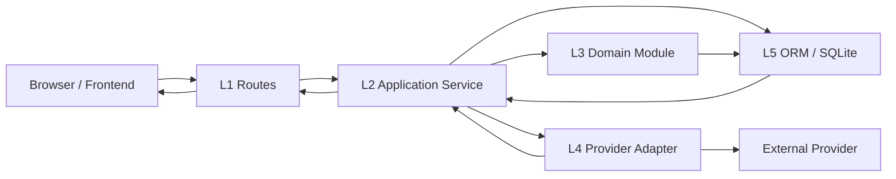
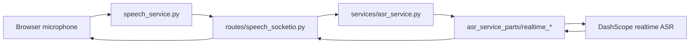
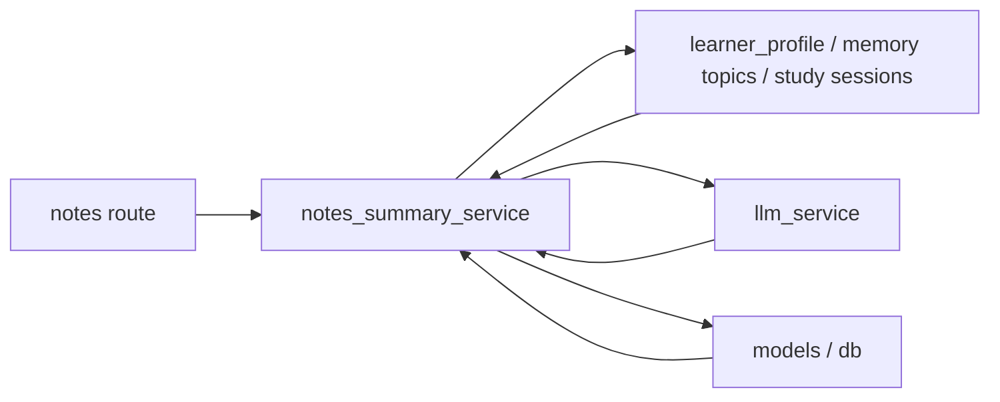

# Backend Layered Architecture

Last updated: 2026-04-08

## Positioning

The current backend should be treated as a **microservice-inspired layered modular monolith in transition to a standardized microservice architecture**.

That means:

- the current codebase is still organized by capability and layer inside one main backend
- data already flows through explicit layers instead of staying in one flat route file
- some runtime concerns are already split into dedicated processes, such as `speech_service.py`
- the system is still one repository and mostly one database today, so it is not yet a true distributed microservice architecture
- the modular monolith is now the migration source architecture, not the long-term target architecture

This document defines the current source architecture, the allowed dependency directions, and the extraction rules for turning the current backend into independent services.

## Layer Model

| Layer | Name | Responsibility | Current locations |
| --- | --- | --- | --- |
| L0 | Runtime and Bootstrap | Process startup, Flask and Socket.IO initialization, proxy/runtime setup, startup repair hooks | `backend/app.py`, `backend/speech_service.py`, `backend/config.py`, `backend/services/runtime_async.py` |
| L1 | Transport and Interface | HTTP and Socket.IO endpoints, auth guards, request parsing, response payloads | `backend/routes/**` |
| L2 | Application Services | Use-case orchestration for one backend capability, transaction coordination, cross-module composition | `backend/services/*_service.py`, `backend/services/study_sessions.py`, `backend/services/session_logging_service.py` |
| L3 | Domain Modules | Business rules, statistics, recommendations, planners, normalization, pure domain helpers | `backend/services/*_parts/**`, `backend/services/learner_profile_service/**` |
| L4 | Provider and Integration Adapters | LLM, TTS, ASR, backup, external APIs, provider-specific protocols | `backend/services/llm_service/**`, `backend/services/word_tts_service/**`, `backend/services/asr_service*`, `backend/services/db_backup*` |
| L5 | Persistence and Data Model | ORM entities, schema definitions, migrations, repository-style storage contracts | `backend/models.py`, `backend/model_definitions/**`, `backend/migrations/**`, `backend/services/*_repository.py` |
| L6 | Scripts, Tests, and Operations | Tests, one-off scripts, repair tools, generated artifacts, caches, operator helpers | `backend/tests/**`, `backend/scripts/**`, root `test_*.py` |

## Capability Modules

These modules cut across the layers above.
Each capability should have code in the layers it actually needs, but not skip boundaries without reason.

| Module | Transport | Application | Domain | Provider / Infra | Persistence |
| --- | --- | --- | --- | --- | --- |
| Auth | `routes/auth*`, `routes/middleware.py` | `services/auth_session_service.py`, `services/auth_middleware_service.py` | `services/auth_session_helpers.py`, `services/auth_session_workflows.py` | token/cookie helpers | `User`, `RevokedToken`, `EmailVerificationCode` |
| Books | `routes/books*` | `books_catalog_service.py`, `books_progress_service.py`, `books_vocabulary_loader_service.py` | `books_confusable_service_parts/**`, `word_catalog_service_parts/**` | optional enrichment adapters | book, chapter, progress models |
| AI Assistant | `routes/ai_routes/assistant/**` | `ai_assistant_*_service.py`, `ai_prompt_context_service.py` | `ai_practice_support_service_parts/**`, `learner_profile_service/**` | `llm_service/**` | conversation, memory, note models |
| Learning Stats and Profile | `routes/ai_routes/profile/**`, `routes/ai_routes/progress/**` | `learning_stats_service.py`, `session_logging_service.py`, `study_sessions.py` | `learning_stats_service_parts/**`, `learner_profile_service/**` | local time/runtime helpers | session, wrong-word, quick-memory models |
| Notes and Summaries | `routes/notes*` | `notes_query_service.py`, `notes_summary_job_service.py`, `notes_summary_service.py` | `notes_summary_service_parts/**` | `llm_service/**` | note and summary models |
| TTS | `routes/tts*` | `tts_sentence_audio_service.py`, `tts_batch_generation_service.py` | synthesis planning parts | `word_tts_service/**`, OSS adapters | audio cache metadata and generated files |
| ASR | `routes/speech.py`, `speech_service.py`, `routes/speech_socketio.py` | `services/asr_service.py` | `services/asr_service_parts/**` | DashScope realtime and file adapters | transient session state, uploaded temp files |
| Shared Runtime | middleware entry points | `db_backup.py`, `db_safety.py` | `local_time.py`, helper modules | runtime async, backup runtime | SQLite and backup files |

## Data Flow

### HTTP API

### Realtime Speech

### Daily Summary Generation

## Dependency Rules

Use these rules as the default import direction.

1. L0 may depend on every lower layer, but should only wire them together.
2. L1 may depend on L2, selected L3 helpers, and middleware contracts.
3. L1 should avoid direct `models` access unless the endpoint is still legacy and not yet extracted.
4. L2 may depend on L3, L4, and L5.
5. L3 should avoid Flask request/response objects.
6. L4 should not emit HTTP response payloads or depend on route names.
7. L5 should expose schema and persistence contracts, not frontend transport semantics.
8. L6 may depend on any layer for testing or tooling, but must not become a runtime dependency.

## Current Non-Ideal Spots

The backend is layered, but not cleanly isolated everywhere.

- Route-level ORM queries, explicit transaction rollbacks, and runtime `route -> route` / `service -> route` reverse imports have been removed from the current backend runtime path. The transport layer now resolves through service-owned modules for auth, admin, books, AI progress, notes, TTS metadata, and ASR.
- Second-phase persistence extraction now covers the admin, books, auth, learning-stats, learner-profile, learning-activity, AI, notes, legacy-progress, and search-cache modules: admin overview and user-management services now depend on `admin_overview_repository.py`, `admin_user_detail_repository.py`, `admin_user_session_repository.py`, and `admin_user_directory_repository.py`; book progress and personal book membership now depend on `books_user_state_repository.py`; favorites/familiar/word-note persistence now depends on `books_personalization_repository.py`; confusable custom-book persistence now depends on `books_confusable_repository.py`; word-catalog persistence now depends on `word_catalog_repository.py`; legacy word-detail migration reads now depend on `legacy_word_detail_repository.py`; auth workflows, middleware, and email verification now depend on `auth_repository.py`; learning stats plus AI context reads now depend on `learning_stats_repository.py`; learner-profile reads now depend on `learner_profile_repository.py`; study-session reads/writes, quick-memory record reads, and learning-event timeline writes now depend on `study_session_repository.py`, `quick_memory_record_repository.py`, and `learning_event_repository.py`; ask/memory/context-related AI reads and note persistence now depend on `ai_assistant_repository.py` plus shared read repositories; AI wrong-word, quick-memory sync, smart-word-stat, and custom-book persistence now resolves through `ai_wrong_word_repository.py`, `ai_quick_memory_repository.py`, `ai_smart_word_stat_repository.py`, and `ai_custom_book_repository.py`; notes query plus daily summary persistence now resolves through `daily_summary_repository.py`, `learning_note_repository.py`, and `notes_summary_context_repository.py`; legacy progress now resolves through `legacy_progress_repository.py`; and LLM web-search cache persistence now resolves through `search_cache_repository.py` instead of issuing ORM queries directly inside the service layer.
- Remaining cleanup is no longer about service-level ORM calls in the main runtime path; the next phase is mainly finer-grained repository decomposition inside the remaining larger read models plus continued removal of `load_split_module_files()` aggregation shells.
- `load_split_module_files()` gives strong file-size control, but it does not create a strong package boundary by itself.
- The previous `service -> routes.ai` and `service -> routes.books` reverse dependencies in the AI and books stacks have been removed. Remaining cleanup is mostly about compatibility exports and future repository-style persistence extraction, not runtime layer coupling.

## Target Shape

Use the current modular monolith as the source architecture, but move the runtime toward a standardized microservice system.

### Target runtime shape

- one external `gateway / BFF` for browser-facing HTTP and version compatibility
- multiple independently deployable capability services behind explicit contracts
- service-to-service calls that carry trace, identity, and authorization context explicitly
- clear authoritative data ownership per service
- no long-term shared-write persistence once a capability becomes a true service
- observability, health checks, rollout, and rollback handled per service rather than only at the monolith level

### Recommended layer ownership

- L0 owns startup, process separation, async patching, config loading
- L1 owns protocol contracts and authorization entry
- L2 owns use-case orchestration and transaction scope
- L3 owns business policy and reusable domain decisions
- L4 owns provider-specific adapters and protocol translation
- L5 owns ORM schema and persistent state
- L6 owns tests, operators, and generated artifacts

### Recommended module ownership

- `auth`
- `books`
- `ai-assistant`
- `learning-stats`
- `notes`
- `tts`
- `asr`
- `shared-runtime`

Each module should expose:

- one transport surface in `routes/**`
- one or more application services in `services/*_service.py`
- one domain package or split-part package for business rules
- zero or more provider adapters when the capability talks to external systems

### Extraction direction

The current preferred extraction order is:

1. `asr-service`
2. `tts-media-service`
3. `catalog-content-service`
4. `ai-execution-service`
5. `learning-core-service`
6. `notes-service`
7. `identity-service`
8. `admin-ops-service`

The gateway / BFF should shrink as these services become authoritative, instead of remaining a second full business backend.

## Migration Order

Apply structural cleanup in this order.

1. Freeze the layer names in docs and use them consistently.
2. Keep extracting transport logic out of routes into application services.
3. Move provider-specific code under dedicated capability adapters such as `asr_service`, `llm_service`, and `word_tts_service`.
4. Reduce direct route-to-model queries by moving them into service modules.
5. Freeze service contracts, observability, and ownership boundaries before splitting deployables.
6. Split complex capabilities into independent deployables only after they have explicit API contracts, health checks, and rollback paths.
7. Split storage only after service ownership is stable; do not use database splitting as a substitute for capability decomposition.

## Immediate Rule For New Backend Code

New backend code should follow this path by default:

`route -> application service -> domain and provider modules -> persistence`

If a new endpoint needs a database query and provider call, do not place both directly in the route.

## Document Index

- Backend overview: [backend/README.md](/F:/enterprise-workspace/projects/ielts-vocab/backend/README.md)
- API contracts: [backend/API.md](/F:/enterprise-workspace/projects/ielts-vocab/backend/API.md)
